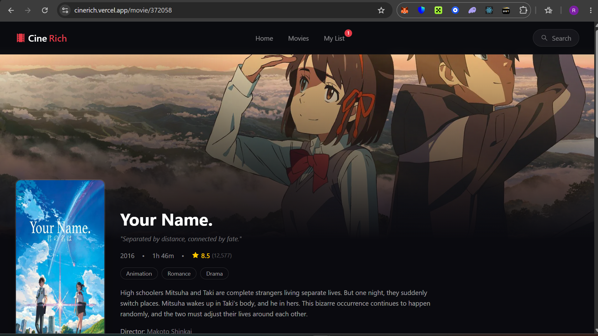
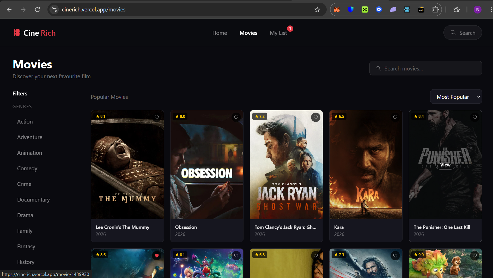
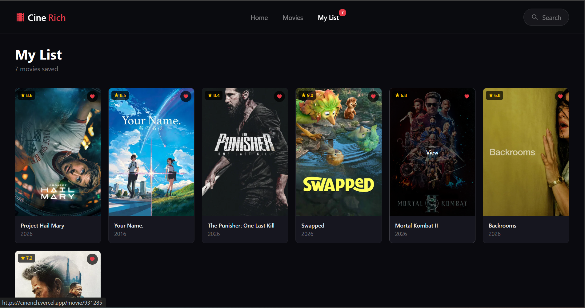

# CineRich 🎬

A full-featured movie discovery web application built with React, TypeScript and Tailwind CSS, powered by the TMDB API.

🔗 **Live Demo:** [cinerich.vercel.app](https://cinerich.vercel.app)


---

## Features

- 🎬 **Browse Movies** — Trending, Popular, Top Rated and Now Playing sections
- 🔍 **Smart Search** — Autocomplete dropdown with debouncing for optimized performance
- 🎭 **Genre Filtering** — Filter movies by genre with a sidebar or mobile pills
- 📊 **Sorting** — Sort by popularity, rating or release date
- 📄 **Pagination** — Navigate through hundreds of pages of results
- 🎥 **Movie Details** — Full details including cast, crew, runtime, genres and similar movies
- ❤️ **My List** — Save favourite movies with localStorage persistence
- 📱 **Fully Responsive** — Optimized for mobile, tablet and desktop
- ⚡ **React Query Caching** — 5 minute cache reduces redundant API calls
- 🌐 **Deployed on Vercel** — CI/CD via GitHub

---

## Screenshots

### Home Page


### Movie Details


### Movies Browse Page


### My List


---

## Tech Stack

| Technology | Purpose |
|------------|---------|
| React 18 | UI framework |
| TypeScript | Type safety |
| Tailwind CSS | Styling |
| React Query | Data fetching and caching |
| React Router v6 | Client side routing |
| Axios | HTTP requests |
| TMDB API | Movie data |
| localStorage | My List persistence |
| Vite | Build tool |
| Vercel | Deployment |

---

## Getting Started

### Prerequisites
- Node.js 18+
- TMDB API key — get one free at [themoviedb.org](https://www.themoviedb.org/settings/api)

### Installation

```bash
# Clone the repository
git clone https://github.com/RichieErnie/cinerich.git

# Navigate to project folder
cd cinerich

# Install dependencies
npm install

# Create environment file
cp .env.example .env
```

Add your TMDB API key to `.env`:
```
VITE_TMDB_API_KEY=your_api_key_here
```

```bash
# Start development server
npm run dev
```

Open [http://localhost:5173](http://localhost:5173) in your browser.

---

## Project Structure

---

## Key Implementation Details

### React Query Caching
```tsx
const queryClient = new QueryClient({
  defaultOptions: {
    queries: {
      staleTime: 1000 * 60 * 5, // 5 minutes
      retry: 1,
    },
  },
});
```
Data is cached for 5 minutes — navigating back to a visited page loads instantly from cache with no additional API requests.

### Search Debouncing
```tsx
const debouncedQuery = useDebounce(query, 500);
```
Search suggestions only fire after the user stops typing for 500ms — preventing excessive API calls on every keystroke.

### My List Persistence
```tsx
const [myList, setMyList] = useState<Movie[]>(() => {
  const stored = localStorage.getItem('cinerich-mylist');
  return stored ? JSON.parse(stored) : [];
});
```
Saved movies persist across browser sessions using localStorage.

---

## API Reference

This project uses the [TMDB API v3](https://developer.themoviedb.org/docs).

| Endpoint | Usage |
|----------|-------|
| `/trending/movie/week` | Trending movies |
| `/movie/popular` | Popular movies |
| `/movie/top_rated` | Top rated movies |
| `/movie/now_playing` | Now playing |
| `/movie/{id}` | Movie details |
| `/movie/{id}/credits` | Cast and crew |
| `/movie/{id}/similar` | Similar movies |
| `/discover/movie` | Filter and sort |
| `/search/movie` | Search movies |
| `/genre/movie/list` | All genres |

---

## Environment Variables
---

## Deployment

This project is deployed on Vercel. Every push to the `main` branch triggers an automatic deployment.

[](https://vercel.com/new/clone?repository-url=https://github.com/RichieErnie/cinerich)

---

## What I Learned

- Integrating a real world REST API with authentication
- React Query for efficient data fetching and caching
- Custom hooks — useDebounce for search optimization
- React Router for multi-page navigation with URL parameters
- TypeScript interfaces for type safe API responses
- Responsive design across all screen sizes

---

## Future Improvements

- [ ] Add TV Shows section
- [ ] User authentication with watchlist sync
- [ ] Movie trailers via YouTube API
- [ ] Advanced filtering — year range, rating range
- [ ] Dark/light mode toggle
- [ ] Infinite scroll instead of pagination

---

## Author

**Richard Ogazi**
- LinkedIn: [linkedin.com/in/richardogazi](https://linkedin.com/in/richardogazi)
- GitHub: [github.com/RichieErnie](https://github.com/RichieErnie)
- Live: [cinerich.vercel.app](https://cinerich.vercel.app)

---

## License

This project is open source and available under the [MIT License](LICENSE).

---

*Built with ❤️ using React, TypeScript and the TMDB API*